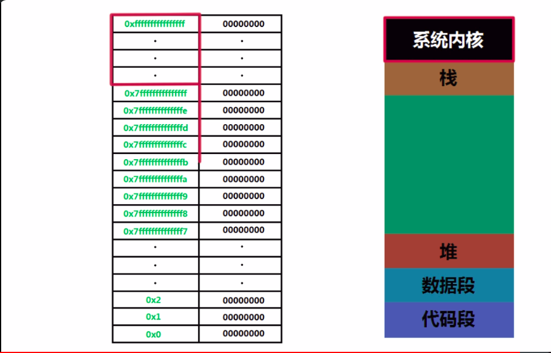

# C语言的指针和内存

## 1.gdb根据的使用

### GDB是用于调试的一种工具，可以轻松的看到程序内部运行结构

```
gcc -g main.c -o main.out 				#将文件转成可支持gdb调试的调试文件
gdb ./main.out 							#进行调试
gdb中的使用方法：
-l										#显示源代码
enter									#继续执行代码
start 									#开始调试
p/print		a							#打印a运行结果
n										#继续执行	
$1/$2/$3								代表第一第二第三执行结果
s										#代表进入函数内部
bt										#查看函数堆栈
f   1									#表示切换到1这个函数栈
q										#退出调试
x/3d <x0ffffffffffffffffff>				# 从开始的地方按照十进制的类型连续显示三位；
```

## 2. 计算机中数据的表示方法

### 计算机中一般以16进制的数来自动分配保存的地址

### 一个16进制的数等于四个2进制的数如（0xF = 1111 = 15）；

```
从上往下分为：
系统内核：								#用于给系统自己处理的内存空间：24个十六进制字节
栈内存：								 #系统自动分配当执行代码程序的时候，需要在栈内分配数据的内存
自由分配区：							    #用于个人处理数据自由分配的空间
堆									   #堆（操作系统）： 一般由程序员分配释放， 若程序员不释放，程											序结束时可能由OS回收，分配方式倒是类似于链表
数据段：								 #用于存储 global const 等全局变量常量的数据
代码段：								 #存储代码的部分，main函数入口也在此区域
```

## 3.指针和内存的实质

```c
//无指针的情况下
#include<stdio.h>
int change(int a，int b)
{
    int tmp = a;
    a = b;
    b = tmp;
}

int main()
{
    int a = 5;
    int b = 3;
    change(a,b);
    printr("a:%d;b:%d",a,b);
    
}

//以上结果输出：a:5;b:3									#结果并没有改变；
// 有指针的情况下
#include<stdio.h>
int change(int *a,int *b)
{
    int tmp = *a;
    *a = *b;
    *b = tmp;
}

int main()
{
    int a = 5;
    int b = 3;
    change(&a,&b);
    printr("a:%d;b:%d",a,b);
    
}
//以上结果输出：a:3;b:5									#结果改变；

```




### 通过以上，得知:

#### 指针*：

#### 保存的就是我们的内存地址；在有\*的情况下，他会根据内存地址找到相应变量的值

#### 如果变量保存的也是内存地址，那么他会根据指针找到变量下的内存的值；指针也就是我们说的线索

#### gdb 中：

#### p	a =>	(a : x0ffffffffffffffff);

#### p	*a =>	5;

#### 变量：

#### 变量实质上就是一个代号，里面可以是值，也可以是内存地址；

#### \&a;

#### 实质上是吧变量a的内存地址取出来；gdb中	p	&a =>	(a : x0ffffffffffffffff);	p	a=>	5;


#### 注意：在我们强行取出一个没有定义的值时，系统会给出一个不确定的值，该值可能带来程序的不可控性；


### 4.内存中各个类型的内存大小：

#### 在分配地址中，编译器会进行内存分配优化，会将所有同类型的分配在相邻；

#### 1. 整型类型：		32位b		4字节；

#### 2. 64位系统下指针会占	64位b	8字节；

#### 3. 32位系统下指针会占	32位b	4字节；


## 5. 栈内存和代码段分配的内存大小；

### 栈内存中：

#### 在执行代码时最先分配的内存最大其次减小；

### 代码段中：

#### 最先分配的最小，其次增大；

### 全局变量：

#### 在数据段中：全局都需要用 所以内存地址一样；

### 静态变量：

#### 在数据段中：他是某个函数特有的；所以内存地址也不一样


## 6. 函数指针：

```
（* pdemo）(a);				pdemo 是一个函数的内存地址
							  通过*来指向该内存下的函数
							  前面（）代表：告诉系统这是代码段下的一个函数不是栈内和堆内的内存地址；让他去代码段内找到该函数
							  后面的（）代表运行并传参；
```


## 7. 数组声明的内存排列；

### 在内存中，数组的排列顺序的连续的

### 数组的定义：int array[3]；		3 代表数组有多少个值；

## 8.指针的运算；

```
指针加：		#会先判断指针下的值是什么类型，然后在根据类型所占空间大小增加字节位数；
指针偏移：		p代表指针;		p+=3;		代表讲指针p向下移动三个（字节）！；
```

